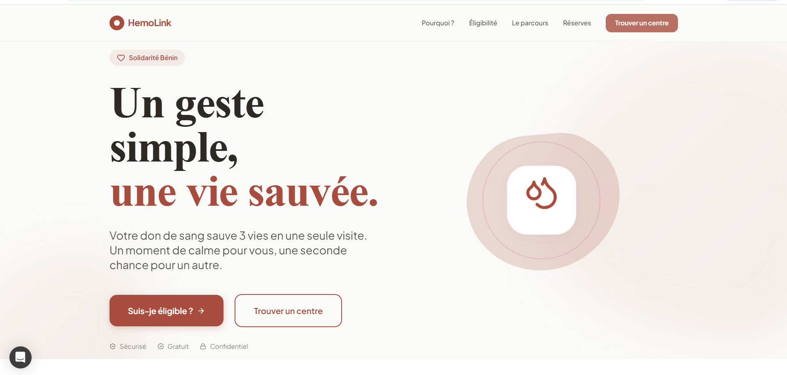
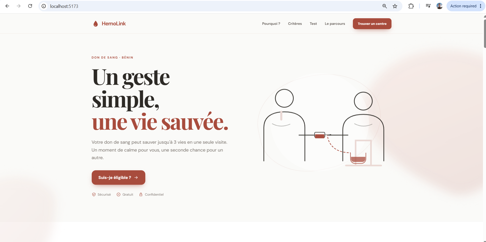
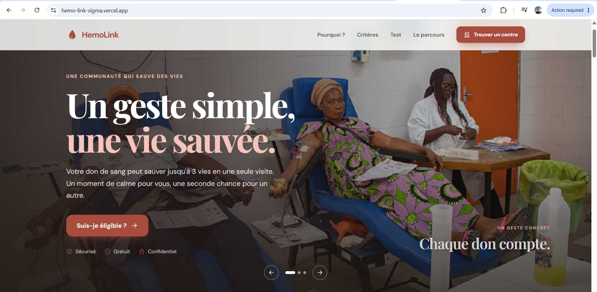

# HemoLink

HemoLink est une plateforme web dédiée au don de sang au Bénin. Elle informe les donneurs, vérifie leur éligibilité de manière indicative et les oriente vers un centre de collecte adapté.

L’objectif est de rendre le don de sang plus simple, plus humain et plus accessible grâce à une interface chaleureuse, des informations claires et des interactions utiles.

## Présentation du projet

La page principale présente :

- un hero introductif autour du message « Une communauté qui sauve des vies » ;
- les raisons de donner son sang ;
- les critères d’éligibilité ;
- un formulaire interactif de vérification ;
- le déroulement et la préparation au don ;
- l’état indicatif des réserves sanguines ;
- une page listant les 8 centres de collecte ;
- une recherche et des filtres par ville, type de don et disponibilité ;
- une FAQ destinée aux nouveaux donneurs.

Le résultat du formulaire reste indicatif. L’aptitude réelle au don est confirmée uniquement par un professionnel de santé lors du rendez-vous.

## Stack technique

- React 19
- TypeScript
- Vite
- CSS natif avec variables, responsive design et animations CSS
- `react-toastify` pour les notifications
- SVG locaux pour les icônes et l’illustration médicale
- ESLint pour la qualité du code
- Vercel pour le déploiement

Commandes principales :

```bash
npm install
npm run dev
npm run lint
npm run build
```

Le projet est déployé sur Vercel. Le fichier `vercel.json` contient une réécriture SPA afin que les routes React, notamment `/centres`, fonctionnent également lors d’un accès direct ou d’un rafraîchissement.

## Architecture principale

Les composants ont été séparés afin de conserver une interface évolutive et réutilisable :

```text
src/
├── components/
│   ├── CentersPage.tsx
│   ├── EligibilityForm.tsx
│   ├── DonationScene.tsx
│   ├── BloodReserves.tsx
│   ├── FaqAccordion.tsx
│   ├── SiteNav.tsx
│   ├── SiteFooter.tsx
│   └── Icon.tsx
├── data/
│   ├── centers.ts
│   ├── bloodReserves.ts
│   └── faqs.ts
├── hooks/
│   └── useToast.ts
├── types/
│   └── hemolink.ts
├── App.tsx
├── App.css
└── index.css
```

## Partis pris de conception

### Une direction visuelle chaleureuse

Le design s’appuie sur une palette crème, rose poudré et rouge profond :

- crème `#FAFAF8` pour créer une atmosphère douce ;
- rouge `#A84C3D` pour les actions, les appels à l’engagement et l’identité HemoLink ;
- rose `#E8D5D0` pour les surfaces secondaires et les détails ;
- texte foncé `#2D2A26` pour conserver une bonne lisibilité.

Les cartes arrondies, les ombres légères et les animations lentes rendent l’expérience plus rassurante qu’une interface médicale froide ou trop institutionnelle.

### Une interface pensée pour l’action

Le parcours principal est volontairement direct : comprendre l’importance du don, vérifier ses critères, puis trouver un centre. Les boutons et les ancres reprennent ce cheminement afin de réduire les hésitations.

### Une approche accessible et responsive

L’interface est conçue pour fonctionner sur mobile, tablette et ordinateur. Les formulaires disposent d’états de focus, les accordéons sont utilisables au clavier et les animations respectent `prefers-reduced-motion`.

## Méthodologie de conception et d’itération

La conception a été menée par étapes avec plusieurs outils d’IA et plusieurs itérations visuelles.

### 1. Préparation du prompt

J’ai demandé à Claude de m’aider à rédiger et améliorer le prompt afin d’obtenir un meilleur résultat dans Superdesign. L’objectif était de décrire clairement le produit, son public, son ambiance et les sections nécessaires, plutôt que de demander uniquement une page générique de don de sang.

Le prompt de départ a ensuite été copié dans `execute.md`.

### 2. Première exploration dans Superdesign

Le prompt a été exécuté dans Superdesign afin d’obtenir une première direction de design. Cette première proposition a ,,,permis de poser la structure, la palette et le ton général de HemoLink.



> **Première proposition Superdesign**

### 3. Itération sur le hero

Après observation du premier résultat, une nouvelle demande a été formulée dans Superdesign : ajouter à droite du hero une interaction visuelle entre un donneur et un professionnel ou receveur, afin de rendre la promesse plus humaine et plus immédiatement compréhensible.

Cette itération a abouti à une scène médicale illustrée montrant l’échange et le geste de don, tout en conservant une esthétique minimaliste et rassurante.



> **Itération du hero**

### 4. Passage par `execute.md` et Codex

Le prompt de référence a été placé dans `execute.md`, puis Codex a été chargé de l’exécuter. Cette étape a généré les fichiers de contexte et de planification suivants :

- `.superdesign/design-system.md` ;
- `.superdesign/init/components.md` ;
- `.superdesign/init/layouts.md` ;
- `.superdesign/init/routes.md` ;
- `.superdesign/init/theme.md` ;
- `.superdesign/init/pages.md` ;
- `.superdesign/init/extractable-components.md` ;
- `IMPLEMENTATION_PLAN.md` ;
- `prompt.md`.

À partir de cette base, l’interface a été implémentée en React avec des composants fonctionnels, des données structurées et des interactions réelles.

### 5. Itérations fonctionnelles

Les demandes successives ont permis d’ajouter et d’affiner :

- la page des 8 centres ;
- la recherche et les filtres ;
- l’algorithme d’éligibilité ;
- le calcul du délai post-don selon le sexe ;
- la date à partir de laquelle un nouveau don est possible ;
- les notifications Toastify ;
- les icônes de centre et l’icône féminine ;
- la compatibilité des routes avec Vercel.

### 6. Vers un hero plus humain

Une dernière évolution demandée consiste à intégrer un carrousel dans la section hero, avec des images prises pendant des séances de don de sang. L’objectif est de remplacer une représentation uniquement illustrative par une présence humaine plus authentique et attractive.

Les images devront rester sobres, professionnelles et suffisamment contrastées pour maintenir la lisibilité du texte du hero. Un overlay sombre ou coloré pourra être ajouté si nécessaire.



> **Résultat final du hero / carrousel**

## Limites et évolutions possibles

- Les centres et les réserves sanguines sont actuellement des données de démonstration statiques.
- Le test d’éligibilité ne remplace pas un entretien médical.
- La réservation, l’authentification et la synchronisation avec un système de santé restent à connecter à une API.
- Les images réelles du carrousel devront être sélectionnées avec attention pour respecter le consentement, la confidentialité et la dignité des personnes photographiées.

## Validation

Le projet est validé avec :

```bash
npm run lint
npm run build
```
